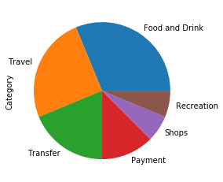
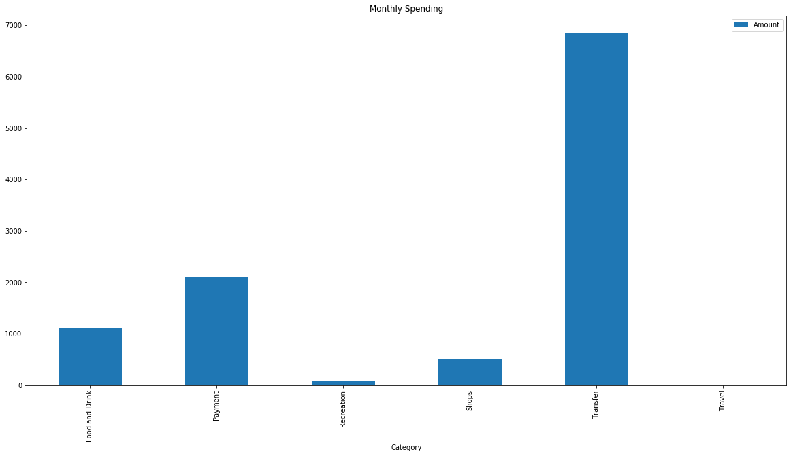
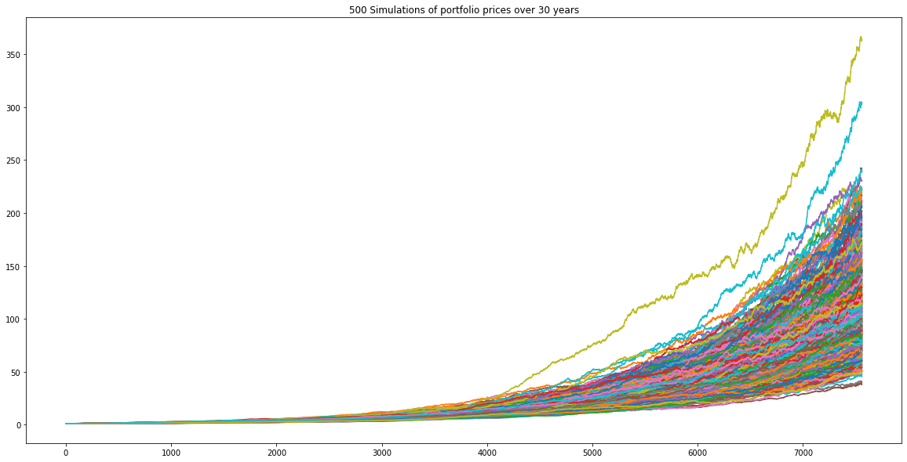
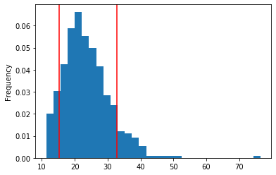
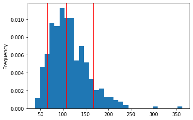

#Financial Report
##Budget Analysis with Plaid
### Alex W 6/7/20

1. **Budjet Ananlysis** : 
If you look at the amount of items by category we see that there are six.  

The biggest expences are food and drink, followed by  travel, and transfers.  The pie chart below is a visual of the amount of items. 

If you look at the expences by amount them category, you can see that the biggest expence is the transfer of funds, followed by payments and food and drink is the third largest expence. The bar chart below shows the magnitude of the biggest expense vs the other expenses. The monthly expenses were also exactly the same for each month of the sample set. 

---
2. **Retirement Planning**: summarixe the retirement portfolio and include the charts for the monte carlos simulation
For the exercise the 2 stocks we are dealing with are AGG and SPY.  AGG is U.S. Aggregate Bond ETF and SPY is SPDR S&P 500 ETF trust .The monte carlo simulation was run for AGG and SPY at 500 simulations of 30 year intervals.    This was done by 252 trading days a year multiplied by 30 years. The simulation was given a .5 percent weight per stock.  for daily returns.  The possible portfilio cumulative returns was plotted below.  Basically all possible returns led to positive growth over the entire period of the simulation.

In the retirement analysis a histogram plot was used to show the outcomes of the portfolio cumulative returns at 20 and 30 years.
*20 Year Returns*

---
*30 Year Returns*

The final question was with a 4% withdrawl rate based on the portfolio having returns in the 90th percentile, would that be more than what is expected to have at the 10th percentile.  The calculations seem to confirm that based on the return rate you would have more than the 4% withdrawl even at the 10th percentile.